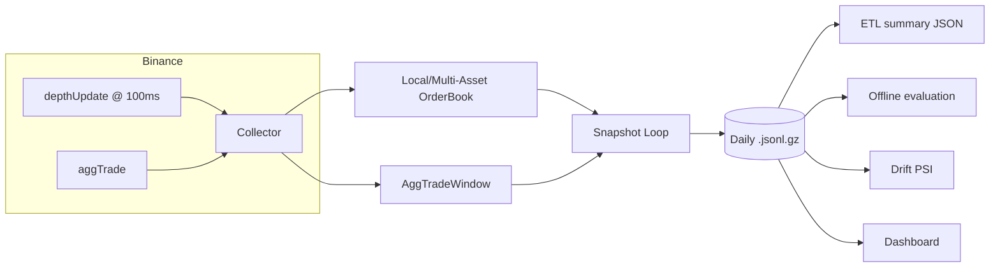

# Quant Crypto Portfolio (L2)

Production-ready packaging of the single-file prototype `btc_ibkr_l2_nautilus_backtest.py` into a maintainable repo.

## What it does

- Collects Binance L2 order book updates (multi-asset, WebSocket depth stream).
- Maintains an in-memory local book per symbol, periodically writing compressed JSONL snapshots.
- (Optional) Collects `aggTrade` and writes rolling trade-window stats into each snapshot.
- Optional online learning (sklearn `partial_fit`) to generate a simple directional score.
- Daily ETL summary (streaming; produces per-symbol JSON reports).

## Architecture



## Repo structure

- `src/quant_crypto_portfolio/collector_binance_ws.py` — WebSocket ingestion + snapshotting
- `src/quant_crypto_portfolio/orderbook.py` — in-memory book + sequencing
- `src/quant_crypto_portfolio/aggtrades.py` — rolling `aggTrade` window stats
- `src/quant_crypto_portfolio/storage.py` — daily gzip writer + optional validation
- `src/quant_crypto_portfolio/offline_eval.py` — SGDClassifier offline eval + signals
- `src/quant_crypto_portfolio/drift.py` — PSI drift report
- `src/quant_crypto_portfolio/dashboard_app.py` — Streamlit dashboard UI

## Install

```bash
python -m venv .venv
source .venv/bin/activate
pip install -U pip
pip install -e ".[binance]"
```

Optional extras:

```bash
pip install -e ".[online]"     # online learning + checkpoints
pip install -e ".[train]"      # offline ensemble training
pip install -e ".[eval]"       # offline evaluation (accuracy + metrics)
pip install -e ".[viz]"        # plots (PNG)
pip install -e ".[dashboard]"  # Streamlit dashboard
pip install -e ".[dev]"        # tests + lint
```

## Usage

Collect (multi-asset):

```bash
qcp collect --data-dir data/l2 --symbols BTCUSDT ETHUSDT --depth 1000 --snapshot-ms 100
```

Include aggregated trades (`aggTrade`) and store rolling trade stats into each snapshot:

```bash
qcp collect --data-dir data/l2 --symbols BTCUSDT ETHUSDT --aggtrades --agg-window-sec 1
```

With online learning:

```bash
qcp collect --data-dir data/l2 --symbols BTCUSDT --online --online-horizon-sec 1 --checkpoint-sec 60
```

Daily summary (defaults to yesterday UTC):

```bash
qcp etl --data-dir data/l2
```

In production, run `qcp etl` via cron (or a scheduled GitHub Action) rather than embedding a scheduler in the collector.

Train ensemble:

```bash
qcp train --data-dir data/l2 --symbol BTCUSDT --horizon-sec 60
```

Offline evaluation (model accuracy + strategy metrics):

```bash
qcp evaluate --data-dir data/l2 --symbol BTCUSDT --horizon-sec 60 --out-json reports/btc_eval.json
```

If the collector is still writing today’s `.jsonl.gz`, evaluation will log a warning and use the readable prefix.

Drift test (PSI; use as a retrain trigger):

```bash
qcp drift --data-dir data/l2 --symbol BTCUSDT --baseline-rows 50000 --recent-rows 50000
```

Plot entry/exit markers from stored signals:

```bash
qcp plot --data-dir data/l2 --symbol BTCUSDT --out reports/btc_signals.png
```

Dashboard (overview + signals + drift + offline eval):

```bash
pip install -e ".[dashboard,eval]"
qcp-dashboard
```

## Logging

- Set `QCP_LOG_LEVEL=DEBUG` to override log level.
- Timestamps are emitted in UTC.

## Configuration examples

Example configs live in `configs/`:

- `configs/collector.example.toml`
- `configs/dashboard.example.toml`
- `configs/logging.env.example`

## Testing

```bash
ruff check .
PYTHONPATH=src python -m unittest discover -s tests -p 'test_*.py' -q
```

## Notes

- Data layout: `data_dir/YYYY-MM-DD/YYYY-MM-DD_<symbol>_l2.jsonl.gz`
- Reports: `data_dir/reports/YYYY-MM-DD_summary.json`
- When `--aggtrades` is enabled, snapshots also include fields like `agg_trade_count`, `agg_buy_qty`,
  `agg_sell_qty`, `agg_imbalance`, `agg_vwap`, and last trade fields.
