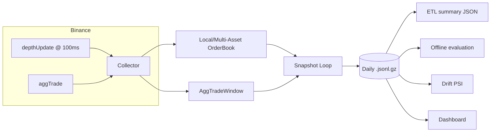

# Architecture

## Data flow

1. `collector_binance_ws.py` subscribes to:
   - `depthUpdate` (`@depth@100ms`) for order book diffs
   - optional `aggTrade` for trade prints (`--aggtrades`)
2. `orderbook.py` maintains a local in-memory book per symbol with gap detection and resync.
3. `aggtrades.py` maintains a rolling time window of aggTrades and exposes computed stats.
4. The snapshot loop periodically writes one JSON row per symbol to daily gzip JSONL:
   `data/l2/YYYY-MM-DD/YYYY-MM-DD_<symbol>_l2.jsonl.gz`
5. Analysis tools read the snapshots:
   - `etl.py` produces daily summary JSON
   - `offline_eval.py` trains/evaluates an SGDClassifier and emits signals
   - `drift.py` computes PSI drift to trigger retraining
   - `dashboard_app.py` visualizes the system

## Storage schema (selected)

Every snapshot row includes:

- `ts_ns`, `ts_utc`, `symbol`
- `best_bid`, `best_ask`, `mid`, `snapshot_id`
- `bid_px_1..N`, `bid_sz_1..N`, `ask_px_1..N`, `ask_sz_1..N`

Optional fields:

- Online learning: `online_score`, `online_pred_class`, `online_signal`
- aggTrade window: `agg_trade_count`, `agg_buy_qty`, `agg_sell_qty`, `agg_imbalance`, `agg_vwap`, plus last-trade fields

